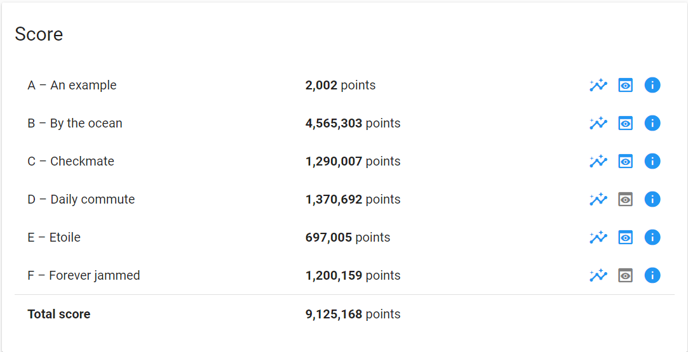

# hashCode2021

Google's HashCode 2021 Contest submission

## Authors

[@TheJonu](https://github.com/TheJonu) and [@edgeboyo](https://github.com/edgeboyo)

## What is this?

A traffic scheduling system written in C# based on data given in a text file.

Output is the most optimal schedule of the lights at specific intersections with street names and intervals of lights from those streets.

### Attained score

